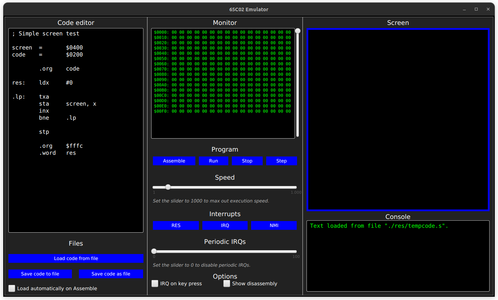

# 65C02 Java Emulator

65C02 Emulator in Java with graphical interface.



# Features

## Assembler

This emulator comes with a 65C02 assembler written completely from scratch

## Files

You can drag and drop files into the code editor; you can load and save your
code; and you can even edit it somewhere else, and have the emulator reload it
every time you click "Assemble".

## Monitor

There is a monitor screen that shows 256 bytes of RAM at a time. This monitor
updates in real time and can be used to inspect the memory of the program
during execution. You also have the option to show a disassembled vision of
the code, which also updates in real time (in case you have self modifying
code).

## Interrupts

The emulator emulates interrupt functionality on the chip, allowing you to
send an interrupt every time you press a key (in addition to getting the key
code). You can also set periodic interrupts, to have an interrupt sent every
couple of ticks (and possibly synchronise some code).

## Debugger

There is a debugger available, through which you may run, stop, and step by
each instruction at a time. In addition to that, you can control the execution
speed, and send various interrupt signals to the CPU. While the program is
running, you can inspect the values of the registers and see them changing
through the console.

## Screen

There is a memory-mapped screen, which you can draw to. This allows you to
write more interesting programs, and maybe even little games.

## Modding?

The 65C02 CPU Emulator is a separate java class in the code. Memory mappers
and additional circuitry can be implemented through the provided class
interface, to interact with the processor. Please see Mapper.java, the
interface whose methods must be overridden for the emulator to work. You can
implement your own graphical interface or other program to interact with the
chip.

# How to use

Every time a key is pressed, its ASCII code is stored in `$FF`, and if the
"IRQ on key press" checkbox is checked, an Interrupt Request Signal is
triggered.

If the "Periodic IRQs" slider is set to a non-zero value, every N ticks an
IRQ is triggered.

To assign functions as interrupt handlers, put their labels/addresses at the
corresponding memory locations:

```
$FFFA-$FFFB : Non Maskable Interrupt (NMI)
$FFFC-$FFFD : Reset (RES)
$FFFE-$FFFF : Interrupt Request (IRQ)
```

Example:

```
.org $FFFA
.word NMI, RES, IRQ
```

To start generating new code at a specific address in memory, you can use the
org directive `.org $xxxx`, where `$xxxx` is that address.

Memory locations `$0400` to `$07FF` map to the screen pixels. Different values 
will draw different colour/character pixels. The pixels are:

```
$00: Black
$01: Dark Red
$02: Dark Green
$03: Dark Yellow
$04: Dark Blue
$05: Dark Purple
$06: Dark Cyan
$07: Light Gray

$08: Dark Gray
$09: Light Red
$0A: Light Green
$0B: Light Yellow
$0C: Light Blue
$0D: Light Purple
$0E: Light Cyan
$0F: White

$10 - $1F: 2x2 Cell with black and white pixels

$20 - $7F: ASCII table

$80 - $BF: Colours (each RGB channel has a 2 bit depth, as in %10BBGGRR)
$C0 - $FF: Greyscale 
```

To extract the low or high byte of a label's address, suffix it with &lt; or
&gt; respectively. Example:

```
test_label:
  lda #<test_label
  sta $00
  lda #>test_label
  sta $01
```

You can also use the label name in expressions, and it evaluates to the
address.

You can use the syntax `SYMBOL = VALUE` to assign an expression to a constant.
These constants can be used throughout your code.

* `.byte value, value, ... value` is used to define constant bytes in memory.
* `.word value, value, ... value` is used to define constant words (16-bit
  integers) in memory.
* `.text "Some text."` is used to define an array of ASCII characters in
  memory.
* `.string "Some text."` does the same but explicitly null-terminates the
  string.
* `.data offset` just skips _offset_ bytes forward. This is useful with labels.

Number literal notations are either:

- `123` for decimal
- `$1234` for hex
- `%10101010` for binary

# How to build:

You must have the java JDK and JRE installed. You can verify by running the
following commands:

```bash
$ java --version
openjdk version "19.0.1" 2022-10-18
$ javac --version
javac 19.0.1
```

To download and run this project, you must type in the following commands (the
JavaFX dependencies come bundled with the source code):

```bash
git clone https://github.com/MarcusPeixe/65C02java.git
cd 65C02java
javac -d bin/ --module-path ./lib --add-modules javafx.controls,javafx.fxml src/*.java
java -cp bin/ --module-path ./lib --add-modules javafx.controls,javafx.fxml Main
```
